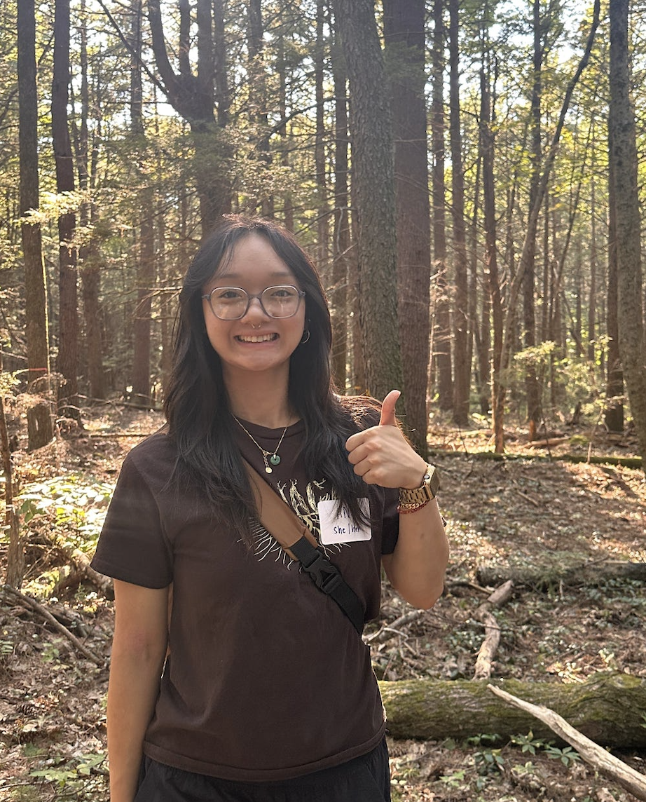

::: {layout-ncol=2}

## Education

I am a first-year in the Ecology, Evolution, and Behavior (EEB) Ph.D. program at the University of Minnesota-Twin Cities. Specifically, I am in the Pinto-Ledezma. Previously, I completed my undergraduate degree in 2025 at St. Olaf College in Southern Minnesota.

{fig-alt="A photo of me with a thumbs up in my left hand. I am wearing a brown shirt with black pants. I am standing in the Harvard Forest where there are many trees, both upright and a few on the forest floor." width="218"}

:::

::: {layout-ncol=2}

I am currently still developing my thesis topic but plan to focus on **angiosperm tree species vulnerability to extinction factors from a phylogenetic perspective.**

:::

::: {layout-ncol=2}

I value interdisciplinary work and will integrate this into my work as I think about the future of climate action and being a better global citizen, constantly expanding my network and learning from those with different stories from me.

:::

::: {layout-ncol=2}

## Beyond work

I am passionate about social justice in many forms, and I am active in the community to create a world more inclusive of the diversities of life. As a first-generation college and graduate student, encouraging budding scientists across identities and the organizations supporting them is paramount. I am a proud TRIO student and new McNair alumni.

:::

::: {layout-ncol=2}

When I am not thinking about a sociocultural transformation, my hobbies include hiking, biking, drawing, painting, knitting, crocheting, and cooking.

:::
